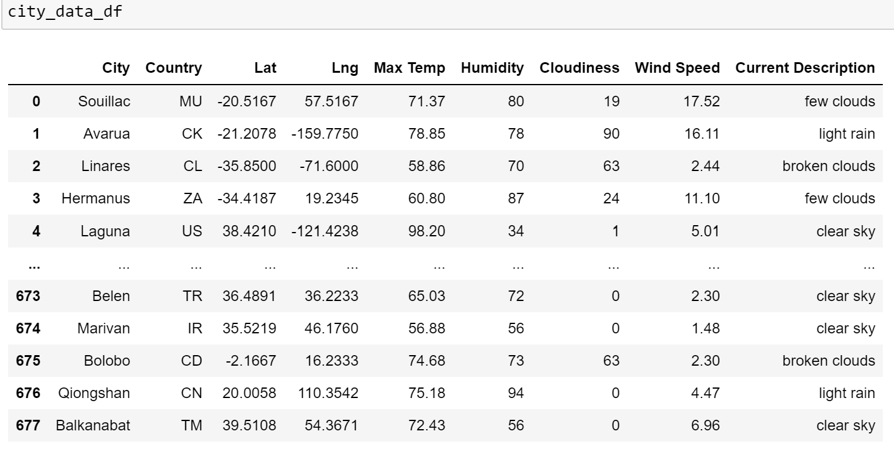
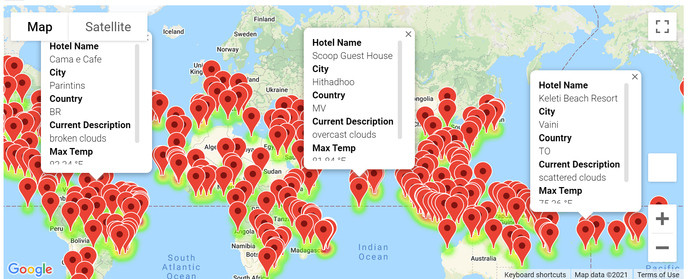
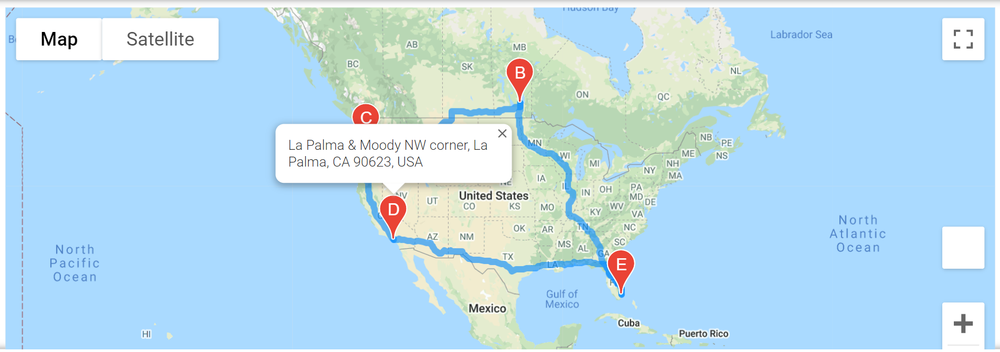
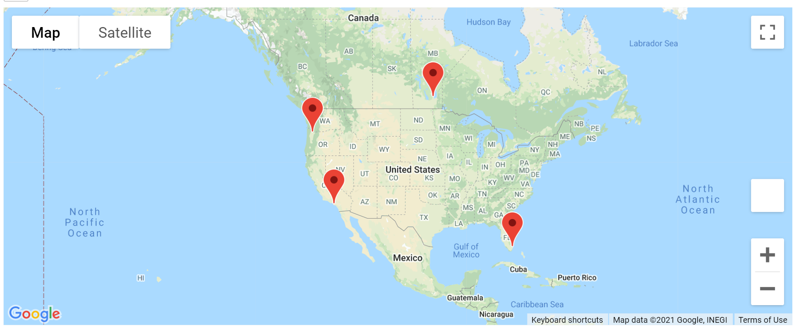

# World_Weather_Analysis
Analysis for My Trip for presenting weather data to customers via a search page.

## 1. The purpose of the World Weather analysis :
This analysis is done for MyTrip, a travel technology company that specializes in internet related services in hotel and lodging industry. Jack, who is the head of analysis for the user interface team wants data to be collected and presented to customers for via search page which can then be filtered based on their preferred travel criteria in order to find an ideal hotel. 
We are retrieving the information using API keys from Openweather.org and from google.
We have also performed statistical analysis using linear regression on weather parameters in the Northern and Southern Hemispheres.
## Basic Project Plan
Following are the list of steps and deliverables :
Here's an outline of your project plan:
•	Task: Collect and analyze weather data across cities worldwide.
•	Purpose: PlanMyTrip will use the data to recommend ideal hotels based on clients' weather preferences.
•	Method: Create a Pandas DataFrame with 500 or more of the world's unique cities and their weather data in real time. This process will entail collecting, analyzing, and visualizing the data.
Your analysis of the data will be split into three main parts, or stages.
1.	Collect the Data
o	Use the NumPy module to generate more than 2000 random latitudes and longitudes.
o	Use the citipy module to list the nearest city to the latitudes and longitudes.
o	Use the OpenWeatherMap API to request the current weather data from each unique city in your list.
o	Parse the JSON data from the API request.
o	Collect the following data from the JSON file and add it to a DataFrame:
	City, country, and date
	Latitude and longitude
	Maximum temperature
	Humidity
	Cloudiness
	Wind speed
2.	Exploratory Analysis with Visualization
o	Create scatter plots of the weather data for the following comparisons:
	Latitude versus temperature
	Latitude versus humidity
	Latitude versus cloudiness
	Latitude versus wind speed
o	Determine the correlations for the following weather data:
	Latitude and temperature
	Latitude and humidity
	Latitude and cloudiness
	Latitude and wind speed
o	Create a series of heatmaps using the Google Maps and Places API that showcases the following:
	Latitude and temperature
	Latitude and humidity
	Latitude and cloudiness
	Latitude and wind speed
3.	Visualize Travel Data
Create a heatmap with pop-up markers that can display information on specific cities based on a customer's travel preferences. Complete these steps:
1.	Filter the Pandas DataFrame based on user inputs for a minimum and maximum temperature.
2.	Create a heatmap for the new DataFrame.
3.	Find a hotel from the cities' coordinates using Google's Maps and Places API, and Search Nearby feature.
4.	Store the name of the first hotel in the DataFrame.
5.	Add pop-up markers to the heatmap that display information about the city, current maximum temperature, and a hotel in the city.

Deliverables :
•	Deliverable 1: Retrieve Weather Data
•	Deliverable 2: Create a Customer Travel Destinations Map
•	Deliverable 3: Create a Travel Itinerary Map
## 2. Results:
### a. Dataframe with 2000 cities – 
Using the openweather.org API key, a dataframe was created. 

 
### b. Create a Customer Travel Destinations Map – 
•	Input statements are written to prompt the customer for their minimum and maximum temperature preferences.
•	A new DataFrame is created based on the minimum and maximum temperature, and empty rows are dropped.
•	The hotel name is retrieved and added to the DataFrame, and the rows that don’t have a hotel name are dropped.
•	The DataFrame is exported as a CSV file into the Vacation_Search folder and is saved as WeatherPy_vacation.csv.
•	A marker layer map with pop-up markers for the cities in the vacation DataFrame is created, 

### c. Create a Travel Itinerary Map –
•	Four DataFrames are created, one for each city on the itinerary.
•	The latitude and longitude pairs for each of the four cities are retrieved.
•	A directions layer map between the cities and the travel map is created and uploaded as WeatherPy_travel_map.png.
•	A DataFrame that contains the four cities on the itinerary is created.
•	A marker layer map with a pop-up marker for the cities on the itinerary is created, and it is uploaded as WeatherPy_travel_map_markers.png. Each marker has the following information:
o	Hotel name
o	City
o	Country
o	Current weather description with the maximum temperature

## Statistical Analysis and Linear Regression :
Apart from the above, some statistical analysis and liner regression was performed on the weather data from the Northern and Southern Hemispheres.

## 3. Summary:
This analysis will help our customers to conclude the following :

a.	The best time of the year for planning a vacation 

b.	Best cities for a vacation based on their preferred weather criteria.

c.	Map these cities using jupyter notebook, gmaps and google places API.
